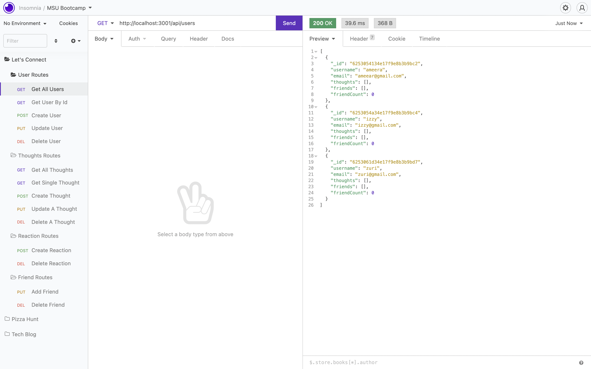

# Let's Connect

## Table of Contents
 * [Description](#Description)
 * [Installation](#Installation)
 * [Usage](#Usage)
 * [Contribution](#Contribution)
 * [License](#License)
 * [Questions](#Questions)

## Description
Let's Connect is a Social Media API where one can create users and thoughts. Users can have others users as friends to make a friends list and also thier thoughts. One is also able to add a reactions to thoughts. This app was designed to demonstrate the functionality of Mongo as a NoSQL database.

## Built With
 * JavaScript
 * Node
 * MongoDB
 * Mongoose
 * Express.js
 * Dayjs
 * Insomnia

## ScreenShot

## Installation
To install this application make sure you have node and mongo installed. Then from the command line run npm install (or npm i) to install the dependencies required for this application to function. Once installed run the command npm start to start the server and connect to the database.

## Usage
To use this application you will need to have insomnia installed. Onced installed start up the server and then go over to insomnia where you can test all CRUD methods. This application can also be connected to an front end and used as a full stack application. For a more detail explination of how Let's Connect works, please watch the following video: https://drive.google.com/file/d/1qULajQbOWfkir3oJNhZ2NmGTGwH-tBmD/view.

## Contribution
If you would like to contribute to this application. Please fork the application to your system and after any updates were made complete a pull request for approval.

## License
This application is covered under the MIT.
For more details about licensing, use this link: https://choosealicense.com/licenses/mit/.

## Questions
For additional information about the project, please find it at the following www.github.com/omcewan.
Also if you have additional questions please contact me at omcewan18@gmail.com.
